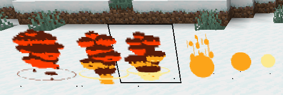

# Display Renderer

Experiment of playing sprite animations using text displays. Inspired by https://github.com/TheCymaera/minecraft-text-display-experiments

Using one text display per entity results in lag when spawning too many entities at once. But by representing the frames of the sprite animation as glyphs of a custom font (requires a custom resource pack), we can play sprite animations of up to 256x256 pixels per frame quite efficiently using a single text display entity and changing its text over time.

# Notes

* Font bitmaps support colors and the alpha channel, so we can use them for sprite animations.
* By using white glyphs, it might be possible to dynamically tint the sprites in a given color using text colors. However, all pixels would then share that same color. But this might be suitable for certain effects (e.g. colored smoke) and then only requires a single font / set of gylphs instead of one set of glyphs per color.
* Text colors don't support alpha values. If they would, we might be able to avoid having to use a custom font and instead dynamically build the sprite image by using for example a multi-line text display where each pixel is represented by one colored box character. We might, however, still require a custom font then to remove the 1 pixel spacing between characters and between rows.
* Minecraft detects the width of each glyph by checking for the last column with a non-empty pixel (alpha > 0) in each glyph image. In order for the frames of the animation to stay horizontally aligned, there needs to be a non-empty pixel in the last column of each frame.

# Further ideas

* Automatically generate the resource pack for a given list of spritesheets.
* Start a local web server to automatically distribute the resource pack to players.
* Instead of spawning the text display entities on the server, send them as fake entities to players to further improve performance (no need for the server to process (e.g. tick) these entities).
* Experiment with more sprite animations, e.g. fires, (colored) smoke, combining sprite animations with sprite-based moving particles, etc.
* It might be possible to support larger sprite animations by splitting the frames into multiple glyphs and showing them side by side, either as a multi-character text display (requires a custom font to remove the 1 pixel spacing between characters), or by using multiple text displays side by side.

# Credits

* Example explosion spritesheet contained in this project: https://ansimuz.itch.io/explosion-animations-pack
